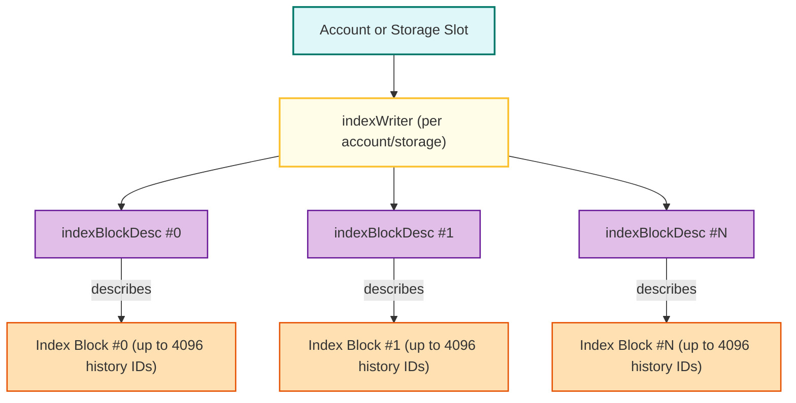
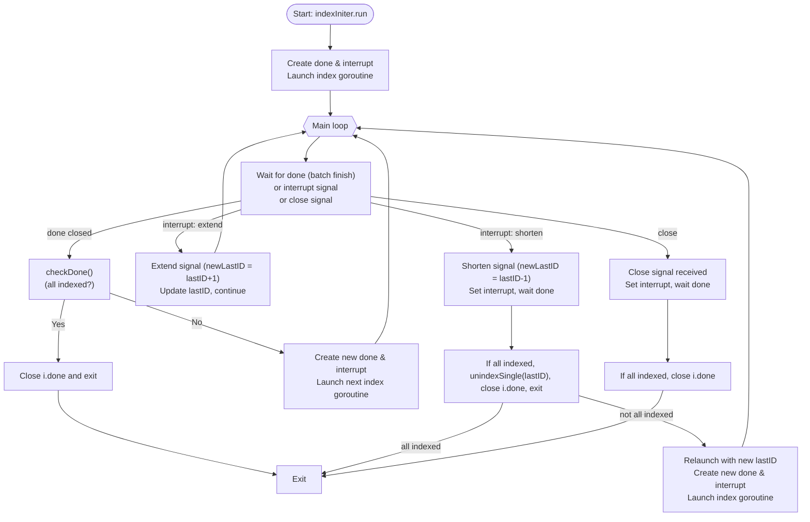

# Triedb/PathDB indexing



- Each account and storage slot has an `indexWriter`
- Each `indexWriter` has a list of `indexBlockDesc`
- Each `indexBlockDesc` has up to 4096 history stateIDs belonging to this account/storage

## Basic Definitions

1. **What is a "history ID"?**

A "history ID" is a unique, monotonically increasing identifier for each state change snapshot, typically corresponding to a block number or a similar sequence.

2. **When are new history IDs generated?**

**Every time a new block is committed** (i.e., finalized and written to the database), the state changes for that block are recorded as a new state history, and a new history ID is assigned.

3. **Why not use block numbers directly?**

- Block numbers are generated from genesis block, while history IDs can be generated from any point in the chain.
- Record StateRoot to history ID mapping, so that we can find the state at a specific history ID.

## **Ancient State Store**

### 1. What's the data structure of a history item?

```go
type history struct {
    meta        *meta                                     // Meta data of history
    accounts    map[common.Address][]byte                 // Account data keyed by its address hash
    accountList []common.Address                          // Sorted account hash list
    storages    map[common.Address]map[common.Hash][]byte // Storage data keyed by its address hash and slot hash
    storageList map[common.Address][]common.Hash          // Sorted slot hash list
}
```

A **history item** (state history object) contains the below fields:

- **meta**: Contains metadata (version, parent state root, state root, block number).
- **accounts**: Map of account address → account data.
- **accountList**: Sorted list of account addresses (for deterministic order).
- **storages**: Map of account address → (map of storage slot → slot data).
- **storageList**: Sorted list of storage slots per account.

### 2. How is the data stored on disk?

When a history item is written (see `writeHistory`), it is encoded and stored in the ancient (freezer) database as **five separate tables**:

- **meta**: Metadata for the history object.
- **account index**: Fixed-size(33 bytes) index entries for each account, sorted, each entry contains:
  - account address hash(20 bytes)
  - length of the account data blob(1 byte)
  - offset in the account data blob(4 bytes)
  - offset of storage index in storage index table(4 bytes)
  - number of mutated storage slots belonging to the account(4 byte)
- **storage index**: Fixed-size(37 bytes) index entries for each storage slot, sorted, each entry contains:
  - storage slot key(32 bytes)
  - length of the storage data blob(1 byte)
  - offset in the storage data blob(4 bytes)
- **account data**: Concatenated account data blobs, RLP encoded of the account state.
- **storage data**: Concatenated storage slot data blobs, RLP encoded of the **storage slot values**.

Those tables can be retrieved by their history ID, which is a unique identifier for each history item.

### 3. How to read a history item?

## **Index Data Structure and Storage**

### `indexWriter`

```go=
type indexWriter struct {
    descList []*indexBlockDesc // The list of index block descriptions
    bw       *blockWriter      // The live index block writer
    frozen   []*blockWriter    // The finalized index block writers, waiting for flush
    lastID   uint64            // The ID of the latest tracked history
    state    stateIdent
    db       ethdb.KeyValueReader
}
```

The `indexWriter` appends new history IDs, rotating to a new block when the current one is full.

The `indexWriter` manages the index for a single state (account or storage slot). It maintains:

- A list of `indexBlockDesc` (metadata for each block of IDs).
- The current block being written to (a `blockWriter`).
- A list of `frozen` blocks need to be flushed into db
- We write the blocks into db in an aggregated batch way. On `finish`, after the total account/storage changes >= 1million for the history ids or newly created chain headers was mined, it writes all new/updated index blocks and metadata to the database in a batch.

### `blockWriter`

```go=
type blockWriter struct {
    desc     *indexBlockDesc // Descriptor of the block
    restarts []uint16        // Offsets into the data slice, marking the start of each section
    scratch  []byte          // Buffer used for encoding full integers or value differences
    data     []byte          // Aggregated encoded data slice
}
```

A `blockWriter` is a in-memory builder for an index block, responsible for:

- Appending new history IDs to an index block in memory.
- Managing the encoding (with restart points, etc.).
- Finalizing the block (producing the byte array to be written to disk).

Once finished, the data produced by `blockWriter` is stored as an index block in the database.

### `indexBlockDesc`

```go
type indexBlockDesc struct {
    max     uint64 // The maximum state ID retained within the block
    entries uint16 // The number of state mutation records retained within the block
    id      uint32 // The id of the index block
}
```

The `indexBlockDesc` struct is a **descriptor for an index block** in the state history index.
It summarizes a block of state mutation records (history IDs) for a specific state (account or storage slot).

- **max**: The largest (latest) state history ID in this block.
- **entries**: How many history IDs are in this block (up to 4096).
- **id**: The sequential ID of this block (used for lookup and storage).

The descriptor is serialized to a fixed 14-byte format for storage.

### Index Structure in Database

The index is a two-layer structure:

- **First layer**: A list of fixed-size metadata blocks (`indexBlockDesc`), each describing a range of history IDs.
- **Second layer**: Each metadata block points to a block of actual history IDs (monotonically increasing), stored in a size-limited block.

#### **Index Metadata (First Layer)**

For each state (account or storage slot), a list of `indexBlockDesc` is stored as a contiguous byte array.
This array is written to the database under a key derived from the state identifier:

- account: `ma{addressHash}`
- storage: `ms{addressHash}{slotHash}`

#### **Index Blocks (Second Layer)**

Each `indexBlockDesc` points to a separate **index block** (the actual list of history IDs).
These blocks are stored under keys that include the state identifier and the block descriptor ID(aka: `blockID`):

- account: `mba{addressHash}{blockID}`
- storage: `mbs{addressHash}{slotHash}{blockID}`

Index blocks are the data structures stored on disk that contain up to 4096 history IDs for a specific account or storage slot.
Each block is a compact, chunked, restart-pointed list of history IDs, each index block contains:

- **Chunks**: Each chunk starts with a full integer (history ID), followed by variable-length encoded differences from the previous value (for compression).
- **Restart Points**: Every 256 entries, a restart pointer is added for fast seeking.
- **Restart List**: At the end, a list of 2-byte pointers to each restart, and a 1-byte count.

This format allows efficient binary search and compact storage, the full structure looks like this:

```
    +---->+------------------+
    |     |      Chunk1      | <-- Chunk 1
    |     +------------------+
    |     |      ......      |
    | +-->+------------------+
    | |   |      ChunkN      | <-- Chunk N
    | |   +------------------+
    +-|---|     Restart1     |
      |   |     Restart...   | <-- 2N bytes(N restart points, each 2 bytes)
      +---|     RestartN     |
          +------------------+
          |  Restart count   | <-- 1 byte(number of restarts)
          +------------------+
```

And the chunk format is as follows:

```
    Restart --> +----------------+
                |  Full integer  |
                +----------------+
                | Diff with prev |
                +----------------+
                |      ...       |
                +----------------+
                | Diff with prev |
                +----------------+
```

- **Chunks**

  - Each chunk starts with a full history ID (uint64, varint-encoded).
  - The rest of the chunk contains deltas (differences) from the previous value, also varint-encoded.
  - Each chunk can hold up to 256 entries (controlled by `indexBlockRestartLen`).

- **Restart Points**

  - Every 256 entries, a new chunk (restart point) is started.
  - A list of 2-byte pointers, each pointing to the start position of a chunk
  - At the end of the block, a list of 2-byte offsets (uint16) points to the start of each chunk.

- **Restart Count**
  - The last byte of the block is the number of restart points (chunks).

##### **Index in the Database**

| Layer        | Data Structure        | Key in DB                                 | Content                                      |
| ------------ | --------------------- | ----------------------------------------- | -------------------------------------------- |
| 1st (meta)   | []indexBlockDesc      | Account/Storage index key                 | List of block descriptors (max, entries, id) |
| 2nd (blocks) | Index block (encoded) | Account/Storage index block key + blockID | Encoded history IDs, restart points, count   |

#### Read history ID for a specific account or storage slot

#### `parseIndexBlock(blob []byte) ([]uint16, []byte)`

`parseIndexBlock` is responsible for parsing a serialized index block (a `[]byte` blob) into two main components:

1. **Restart points** (`[]uint16`): Offsets into the data where each chunk (restart section) begins.
2. **Data slice** (`[]byte`): The actual encoded data for all the integers in the block, excluding the restart table and count at the end.

### **How does the function work?**

1. **Read the restart count:**
   The last byte of the blob tells you how many restart points there are.
2. **Read the restart offsets:**
   The preceding `2 * restartCount` bytes are the restart offsets.
3. **Validate and extract:**
   The function checks that the restarts are valid and strictly increasing.
4. **Return:**
   - The list of restart offsets (`[]uint16`)
   - The data section (`[]byte`), which is everything before the restart table and count.

#### `indexReader.readGreaterThan(id uint64) (uint64, error)`

This is a binary search over the restart points.

```go
index := sort.Search(len(br.restarts), func(i int) bool {
    item, n := binary.Uvarint(br.data[br.restarts[i]:])
    // ... compare item to target ...
})
```

### How it works:

1. **Each chunk starts with a full integer value.**

   - This value is the first item in the chunk and is stored in full (not as a diff).

2. **To find the chunk containing your target value:**

   - You can use **binary search** over the restart points.
   - For each restart point, decode the first integer at that offset.
   - Compare it to your target value.
   - This allows you to efficiently find the chunk that may contain your target.

3. **Once you find the right chunk:**
   - You decode sequentially within that chunk (using the diffs) until you find your target or pass it.

## Workflow

**How does the indexer handle new history IDs?**

When a new block is committed:

- The state history for that block is written to the freezer (ancient store).
- The indexer is notified (see `historyIndexer.extend(historyID)`).
- The indexer adds the new history ID to the index for all affected accounts and storage slots.
- This is done either synchronously (if the indexer is caught up) or by the background indexer (if still catching up).

### Indexing

```go
type historyIndexer struct {
    initer  *indexIniter
    disk    ethdb.KeyValueStore
    freezer ethdb.AncientStore
}
```

`historyIndexer` manages the lifecycle of the indexer:

- On startup, it launches a background one-time indexer(the `indexIniter`) to catch up on any missing indexes.
- After initialization, new histories are indexed **synchronously** as they are written, and unindexed if rolled back.
- After initialization, it also provides accessing to historical states, used in the `historyReader` for archive node.

Here is a diagram describing the workflow of `indexIniter.run`, with a focus on how it handles "extend" and "shorten" signals:



Tips:

1. if a extend signal is received, the indexer will continue processing histories, extending the indexing range to include new histories.
1. if a shorten signal is received, the indexer will **stop processing new histories immediately** and wait for the current batch to finish.

- **Batch Indexing**:

  - `indexIniter` is a background worker that ensures all available state histories are indexed.
    - It tracks progress and can be interrupted to extend or shorten the indexing range (e.g., for new histories or rollbacks).
    - It processes histories in batches, updating progress and handling interruptions for dynamic chain changes.
  - `batchIndexer` accumulates history IDs for accounts and storage slots as it processes state histories.
  - When a batch is ready (by mutation count or force), it writes (or deletes) the corresponding index entries in parallel, then commits the batch to database.
  - The batch indexer can operate in both indexing and unindexing (deletion) modes.

- **Single History Indexing/Unindexing**:

  - `indexSingle` and `unindexSingle` handle the addition or removal of a single state history(when new block was mined or reverted), ensuring order and consistency.
  - single history indexing is done synchronously, and write each history ID to the database immediately(set force=true).

- **Persistence**:

The indexer groups history IDs by account or storage, then for each state, uses an `indexWriter` to append the new IDs and update the index.
The index is stored as a list of block descriptors (metadata) and a set of compact index blocks,
both persisted to the database under keys derived from the state identifier.

- When new history IDs are added:
  1. The `indexWriter` appends the new history IDs to the current block descriptor.
  2. If the block descriptor is full, it is finalized and a new descriptor(via `newIndexBlockDesc`) is started.
  3. On `finish()`, all new/updated blocks and the updated descriptor list are written to disk in a batch.
- When reading, the descriptor list is loaded first, then the relevant block is loaded as needed.

### Reading

- `indexReader` loads the index metadata and can efficiently locate the first history ID greater than a given value.
- It loads index blocks on demand and caches them.

### Deleting

- `indexDeleter` removes the most recent history IDs, deleting empty blocks and updating metadata as needed.
- It deletes the rollbacked history IDs only, for the old not used indexs(older than `--history.state`), it will not delete them immediately.

## **History Index Reader?**

The **history index reader** is a component that allows you to efficiently look up the history of state changes (history IDs) for a specific account or storage slot.
It is designed to answer queries like:

- What is the balance of account X at history ID Y?
- What is the next history ID for this account after X?
- Does this account/storage slot have a change at or after block Y?

### **`historyReader` struct**

```go
type historyReader struct {
    disk    ethdb.KeyValueReader
    freezer ethdb.AncientReader
    readers map[string]*indexReaderWithLimitTag
}
```

- The **disk** database (where the index metadata and blocks were stored).
- The **freezer** (where the raw state data were stored).
- A cache of `indexReaderWithLimitTag` objects for fast repeated access.

### **`indexReaderWithLimitTag`**

```go
type indexReaderWithLimitTag struct {
    reader *indexReader
    limit  uint64
    db     ethdb.KeyValueReader
}
```

- Wraps an `indexReader` and tracks the highest history ID that is currently indexed (for consistency with the current state of the index).
- Ensures you don’t read beyond what’s actually indexed.

### **`indexReader`**

```go
type indexReader struct {
    db       ethdb.KeyValueReader
    descList []*indexBlockDesc
    readers  map[uint32]*blockReader
    state    stateIdent
}
```

The `indexReader` is a core object to read the history index records associated with a specific state element (account or storage slot).

The core responsibilities of the `indexReader` include:

- Loads the list of `indexBlockDesc` for a state element.
- Loads and caches index blocks as needed.
- Can efficiently search for the next history ID greater than a given value.

### **Querying**

- To look up history for a specific account/storage slot:
  1. The reader loads (or reuses) the `indexReaderWithLimitTag` for that state.
  2. The `indexReader` loads the metadata (`descList`) and relevant index blocks from disk as needed.
  3. It uses binary search and restart points to efficiently find the next history ID after a given value.
  4. Read the history ID from the freezer to get the actual state at that history ID.

## **Summary Table**

| Component                 | Role                                                     |
| ------------------------- | -------------------------------------------------------- |
| `historyReader`           | Top-level reader, manages cache and access to DB/freezer |
| `indexReaderWithLimitTag` | Wraps `indexReader`, tracks highest indexed history ID   |
| `indexReader`             | Loads metadata/blocks, performs efficient lookups        |
